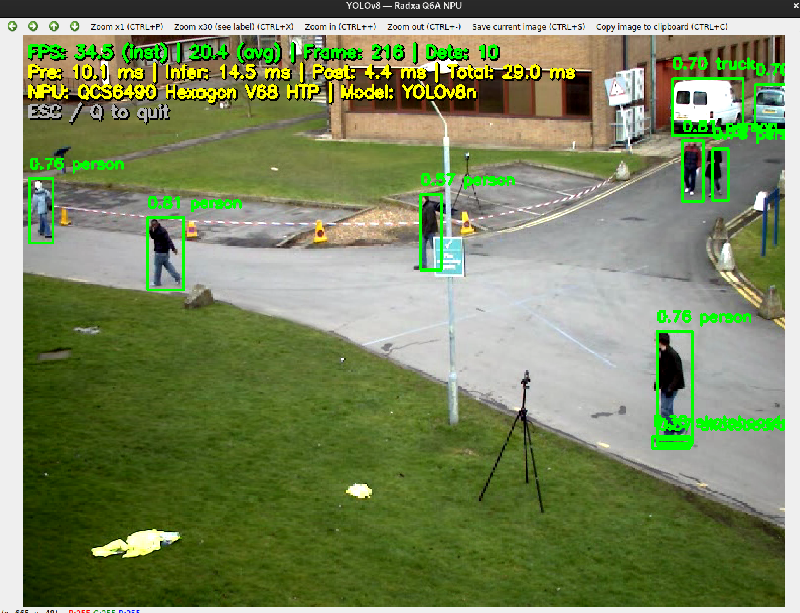

# YOLOv8 Video Inference on Radxa Dragon Q6A NPU

Real-time YOLOv8 object detection on video files using the Qualcomm QCS6490
Hexagon V68 HTP (NPU).  Displays a live OpenCV window with bounding boxes,
FPS counter (smoothed + min/max), per-frame pipeline timing, and saves a
benchmark report on exit.


---

## Requirements

- Radxa Dragon Q6A running Ubuntu 24.04
- QNN SDK headers at `/home/radxa/qairt/include/`
- Compiled `.bin` model + `_config.json` in `../quantized_compiled_model/`

```bash
sudo apt install g++ cmake libopencv-dev
pip install onnxruntime-qnn
```

---

## Project structure

```
cpp_test_video/
├── main.cpp                   # Video loop, timing, display, report
├── preprocess.hpp / .cpp       # Letterbox preprocessor (image + cv::Mat)
├── inference.hpp / .cpp        # QNN HTP runtime
├── postprocess.hpp / .cpp      # Parse, NMS, draw boxes, debug overlay
├── evaluate.hpp / .cpp         # mAP evaluation (--map) on image datasets
├── data/                       # Image datasets (YOLO label format)
│   ├── train/  test/  valid/
│   └── .../images  .../labels
├── CMakeLists.txt
├── build.sh                    # Build script (optional)
├── mkrelease.sh                # Release bundler (libs + model + binary)
├── README.md
├── test_video.mp4
└── build/                      # CMake build output + release bundle
    ├── yolov8_video            # Compiled binary
    └── release/                # Self-contained deployment bundle
        ├── yolov8_video        # Binary (RPATH=$ORIGIN/lib:)
        ├── run.sh              # Launcher
        ├── test_video.mp4
        ├── data/               # Dataset (for --map)
        ├── lib/                # QNN + OpenCV .so files
        ├── model/              # .bin + _config.json
        ├── report.txt          # Video benchmark, generated on exit
        └── eval_report_*.txt   # mAP reports (one per dataset)
```

---

## Build

### Quick build

```bash
cd cpp_test_video
bash build.sh
```

### Manual build

```bash
cd cpp_test_video
cmake -B build -DCMAKE_BUILD_TYPE=Release
cmake --build build -j$(nproc)
```

### Build + release bundle (for deployment)

```bash
bash build.sh --release
# or:
cmake --build build --target release
```

The release bundle at `build/release/` is self-contained — copy it to any
Radxa Q6A device and run `./run.sh`.

---

## Run

### From build directory (source tree)

```bash
cd build
./yolov8_video --video ../test_video.mp4
```

### From release bundle

```bash
cd build/release
./run.sh --video test_video.mp4
```

### Headless benchmark (no window, faster)

```bash
./yolov8_video --video test_video.mp4 --no-show
```

### RTSP camera stream

```bash
./yolov8_video --rtsp rtsp://192.168.1.100:8554/stream
```

### mAP evaluation on image data

Runs the same QNN pipeline on every image of a dataset and computes
COCO/Ultralytics-style metrics against the YOLO-format labels.  One
dataset per run — run all three splits like this:

```bash
./yolov8_video --map data/train
./yolov8_video --map data/valid
./yolov8_video --map data/test --classes 1 --conf 0.001 --iou 0.7
```

`--map` without a dataset defaults to `data/valid`.  The dataset folder must
contain `images/` (jpg/png/bmp) and `labels/` (YOLO txt: one line per box,
`class cx cy w h`, normalized).  Evaluation defaults to `conf 0.001` /
`iou 0.7` / `max_det 300` (Ultralytics val.py defaults) unless `--conf` /
`--iou` are given.

Metrics (same conventions as Ultralytics):

- **mAP@0.5** — AP at IoU 0.5
- **mAP@0.5:0.95** — mean AP over 10 IoU thresholds (0.50…0.95, step 0.05)
- **Precision / Recall / F1** — at the max-F1 operating point
- AP uses 101-point interpolated precision-recall curves

The full report (per-IoU-threshold AP table, per-class table, pipeline
timing) is printed and saved to `eval_report_<dataset>.txt` next to the
binary (e.g. `eval_report_valid.txt`).  Output dequantization (scale +
offset) is read from the compiled `.bin` metadata, so each model's own
quantization parameters are applied automatically.

---

## Command-line options

| Option | Default | Description |
|---|---|---|
| `--video PATH` | `./test_video.mp4` | Input video file |
| `--rtsp URL` | — | RTSP stream URL (low-latency mode) |
| `--lib DIR` | `./lib` | Directory containing QNN .so files |
| `--conf FLOAT` | `0.25` | Confidence threshold |
| `--iou FLOAT` | `0.50` | NMS IoU threshold |
| `--map [DATADIR]` | `data/valid` | Run mAP evaluation on one image dataset (report saved as `eval_report_<dataset>.txt`) |
| `--classes N` | `1` | Number of model classes (used with `--map`) |
| `--no-show` | off | Disable display window (benchmark mode) |
| `--help` | | Show usage |

### Controls

| Key | Action |
|---|---|
| `ESC` | Quit and save report |
| `q` / `Q` | Quit and save report |

---

## On-screen overlay

```
FPS: 20.8  avg: 20.8  min: 18.2  max: 28.7  #795 det:13
pipe: 48.3 fps (20.7 ms)  pre:7.1  inf:12.6  post:1.1 ms
NPU: QCS6490 HTP | YOLOv8n  |  ESC/Q quit
```

- **FPS** — EMA-smoothed wall-clock FPS (dampened, low jitter)
- **avg** — cumulative average wall-clock FPS
- **min / max** — wall-clock FPS range (after 5-frame warmup)
- **pipe** — NPU pipeline FPS and ms breakdown (preprocess / inference / postprocess)
- Green text = > 25 FPS; yellow = slower
- Semi-transparent dark background behind text for readability on any scene

---

## Report

On exit, `report.txt` is saved next to the binary:

```
============================================================
  YOLOv8 Video Inference Report
============================================================
  Date:       Sat May 31 22:32:00 2026
  Video:      test_video.mp4
  Model:      .../model/job_xxx.bin
  Confidence: 0.25
  IoU:        0.50
------------------------------------------------------------
  Frames:     795
  Total time: 38.2 s
  Avg FPS:    20.8
  Min FPS:    18.2
  Max FPS:    28.7
------------------------------------------------------------
  Avg preprocess:   7.07 ms
  Avg inference:    12.59 ms
  Avg postprocess:  1.06 ms
  Avg total:        20.72 ms
============================================================
```

All FPS values (avg/min/max) measure the same wall-clock metric including
display overhead, so they are directly comparable.

---

## Evaluation report

`--map` writes `eval_report_<dataset>.txt` next to the binary:

```
============================================================
  YOLOv8 Evaluation Report (COCO-style mAP)
============================================================
  Date:            2026-08-13 02:14:02
  Dataset:         data/valid
  Model:           .../model/yolov8_q6a.bin
  Images:          104
  GT boxes:        126
  Predictions:     1509
  Conf: 0.001   NMS IoU: 0.70   Classes: 1   Max det: 300
------------------------------------------------------------
  mAP@0.5          0.6980
  mAP@0.5:0.95     0.3488
  Precision        0.5652
  Recall           0.7222
  F1-score         0.6341
  Best conf        0.435   (operating point of P/R/F1)
------------------------------------------------------------
  AP per IoU threshold:
    IoU      AP
    0.50    0.6980
    ...
    0.95    0.0000
------------------------------------------------------------
  Per class:
    Class              Img    GT    AP50    AP50-95   Prec    Rec     F1
    ganoderma          63    126   0.6980   0.3488   0.5652  0.7222  0.6341
------------------------------------------------------------
  Timing:
    Total:           1.7 s   (60.9 images/s)
    ...
============================================================
```

### Measured results — `yolov8_q6a.bin` (int8 on QNN HTP)

Conf 0.001 / NMS IoU 0.7 / max det 300, class `ganoderma`:

| Split | Images | GT boxes | mAP@0.5 | mAP@0.5:0.95 | Precision | Recall | F1 |
|---|---|---|---|---|---|---|---|
| train | 987 | 1215 | 0.9305 | 0.5732 | 0.8271 | 0.8856 | 0.8553 |
| valid | 104 | 126 | 0.6980 | 0.3488 | 0.5652 | 0.7222 | 0.6341 |
| test | 42 | 50 | 0.7004 | 0.4050 | 0.6364 | 0.7000 | 0.6667 |

Notes on reading these numbers:

- **Train mAP < 100 % is expected.**  The model learns generalizable
  features rather than memorizing every box, and the evaluated model is
  int8-quantized for the NPU — weights and activations are rounded to
  8-bit, which typically costs a few mAP points versus the float32
  weights.  The float32 `.pt` will score higher on the train split; the
  difference is the quantization cost.  (100 % train mAP would indicate
  overfitting/memorization, not a better model.)
- **The train → valid/test gap (~0.93 → ~0.70) is the generalization
  gap** — this is the number to watch, not the train score.
- mAP matching is strict: a detection counts only if it overlaps its
  ground truth with IoU > threshold, and duplicate predictions count as
  false positives, so a few near-miss boxes measurably lower the score.

---

## Performance

Tested on Radxa Dragon Q6A (QCS6490) with 640x640 input video:

| Metric | Time |
|---|---|
| Preprocess (letterbox + RGB + NCHW) | ~7 ms |
| **Inference (QNN HTP)** | **~13 ms** |
| Postprocess (parse + NMS + draw) | ~1 ms |
| **Pipeline total per frame** | **~21 ms** |
| **Wall-clock FPS (with display)** | **~21** |
| Pipeline FPS (headless, --no-show) | ~35 |

Display overhead (`cv::imshow` + `cv::waitKey`) is significant on the Q6A.
Use `--no-show` for accurate pipeline benchmarking.

---

## Deploy

Copy `build/release/` to any Radxa Q6A device:

```bash
scp -r build/release radxa@target:/home/radxa/yolov8_video/
```

On the target:

```bash
cd /home/radxa/yolov8_video
./run.sh --video my_video.mp4
```

---

## Troubleshooting

**`dlopen HTP: libQnnHtp.so: cannot open`**
Make sure `lib/` is next to the binary. The RPATH `$ORIGIN/lib:` should
find it automatically, or use `run.sh` which sets `ADSP_LIBRARY_PATH`.

**`contextCreateFromBinary` fails**
SDK version mismatch. The bundled libs must be from onnxruntime-qnn
(2.45.40), not the system QAIRT SDK (2.40.0).

**Flickering / double boxes**
Adjust IoU: `--iou 0.3` (more aggressive) or `--iou 0.7` (looser).

**Low FPS with display window**
Expected on the Q6A — OpenCV window rendering costs ~10-15 ms/frame.
Use `--no-show` for benchmarking or reduce window resolution in `main.cpp`
(`WINDOW_W` / `WINDOW_H` constants).
